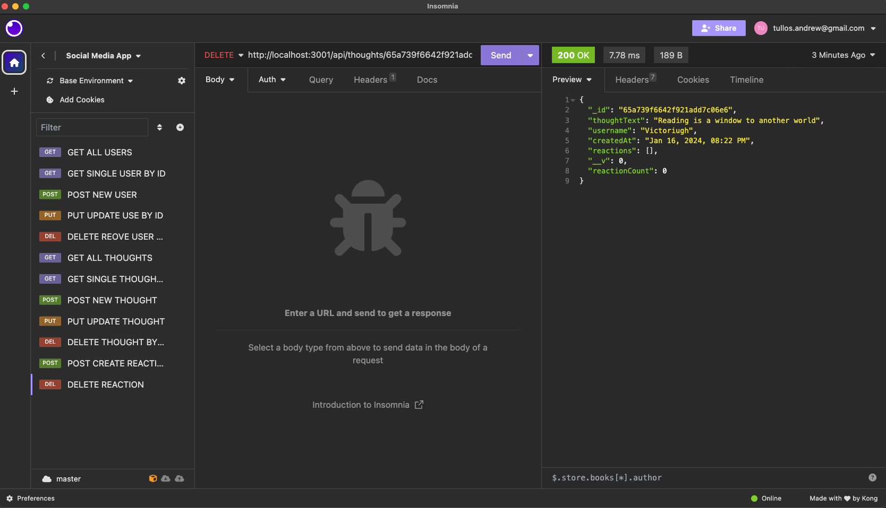

# friendly

## Overview

Welcome to Friendly, a backend social media platform designed to connect users in a simple yet effective way. Built using MongoDB, Mongoose, Express, and JavaScript, Friendly is crafted to provide a robust and scalable backend solution for social media applications. It leverages the power of MongoDB for efficient data storage and retrieval, and the flexibility of Mongoose for schema-based solution to model your application data.

## Feature

Friendly offers a variety of API routes to handle different functionalities required in a social media platform:

[Github Link](https://github.com/AndrewTullos/friendly)

## Table of Contents

- [Projects](#projects)
- [Technologies](#technologies)
- [Usage](#usage)
- [Contact](#contact)

## Projects

This section showcases a variety of projects I have worked on, demonstrating my versatility and expertise in software development. Each project is detailed with its objectives, technologies used, and my role in its development.

## Technologies

Friendly utilizes:

- MongoDB: A NoSQL database for storing user and social interaction data.
- Mongoose: An ODM for MongoDB and Node.js for modeling and managing data.
- Express: A web application framework for Node.js to handle HTTP requests.
- JavaScript Date Object: For timestamping user interactions like thoughts and reactions.

# Usage

Guidelines on how to use the API routes, including example requests and expected responses.

## Contact

Details on how to get in touch with me, including social media links, email, and a contact form for direct inquiries.

## License

This portfolio is open for public viewing and serves as a representation of EDX bootcamps critera for assignment.

# Sources

- https://mongoosejs.com/docs/validation.html
